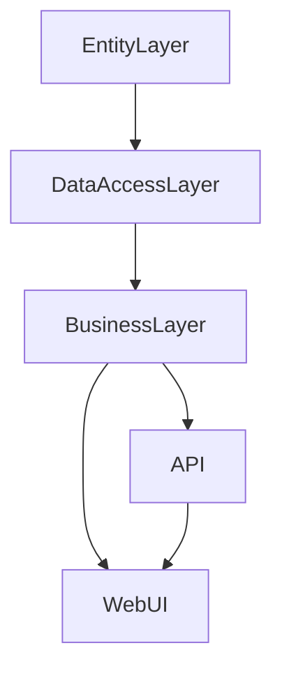

# TeknoromaApp

TeknoromaApp, çok katmanlı mimariyle geliştirilmiş, .NET tabanlı bir ticari uygulamadır. Proje, sürdürülebilirlik ve ölçeklenebilirlik göz önünde bulundurularak katmanlara ayrılmıştır. Hem API hem de Web arayüzü sunar.

## Proje Katmanları ve Yapısı

- **EntityLayer**: Temel veri modellerinin (entity) ve enumların tanımlandığı katmandır.
- **DataAccessLayer**: Veritabanı işlemlerinin gerçekleştirildiği, repository deseninin uygulandığı katmandır. Hem abstract (arayüzler) hem de concrete (gerçekleştirim) klasörleri içerir.
- **BusinessLayer**: İş kurallarının ve servislerin yer aldığı katmandır. Servis arayüzleri (Abstract) ve servislerin gerçekleştirimleri (Concrete) burada bulunur.
- **API**: RESTful servislerin bulunduğu, dış dünya ile iletişimi sağlayan katmandır. Controller dosyaları ile veri alışverişi yapılır.
- **WebUI**: Kullanıcı arayüzünün bulunduğu katmandır. ASP.NET Core MVC ile geliştirilmiştir. Controller ve View klasörleriyle klasik MVC yapısı sunar.

## Temel Özellikler

- Çok katmanlı mimari (Layered Architecture)
- Repository ve Service desenleri
- Entity Framework Core ile veri erişimi
- Hem API hem de Web tabanlı kullanıcı arayüzü
- Modern .NET standartları

## Kurulum

1. **Projeyi klonlayın:**
   ```bash
   git clone https://github.com/SametDulger/TeknoromaApp.git
   ```

2. **Gerekli NuGet paketlerini yükleyin:**
   - Visual Studio ile açtığınızda eksik NuGet paketleri otomatik olarak yüklenecektir.
   - Manuel yükleme için:
     ```bash
     dotnet restore
     ```

3. **Veritabanı yapılandırması:**
   - `appsettings.json` dosyalarında bağlantı stringini kendi veritabanınıza göre güncelleyin.
   - Migration işlemleri için:
     ```bash
     dotnet ef database update --project DataAccessLayer
     ```

4. **Projeyi başlatın:**
   - Çözümü (`TeknoromaProject.sln`) Visual Studio ile açın.
   - Başlangıç projesi olarak `WebUI` veya `API` katmanını seçin.
   - F5 ile çalıştırın.

## Katmanlar Arası Bağımlılıklar



## Önemli Klasörler ve Dosyalar

- `EntityLayer/Concrete/` : Tüm ana veri modelleri (ör. Product, Order, Customer, vb.)
- `DataAccessLayer/Concrete/` : Entity Framework ile yazılmış repository sınıfları
- `BusinessLayer/Concrete/` : Uygulama iş kurallarını içeren servisler
- `API/Controllers/` : API endpointlerini yöneten controllerlar (örn. ProductController)
- `WebUI/Controllers/` : Web arayüzü için controllerlar
- `WebUI/Views/` : Razor tabanlı sayfa şablonları

## Kullanılan Teknolojiler

- .NET 5 (C#)
- ASP.NET Core MVC & Web API
- Entity Framework Core
- Katmanlı Mimari
- HTML, CSS, JavaScript
